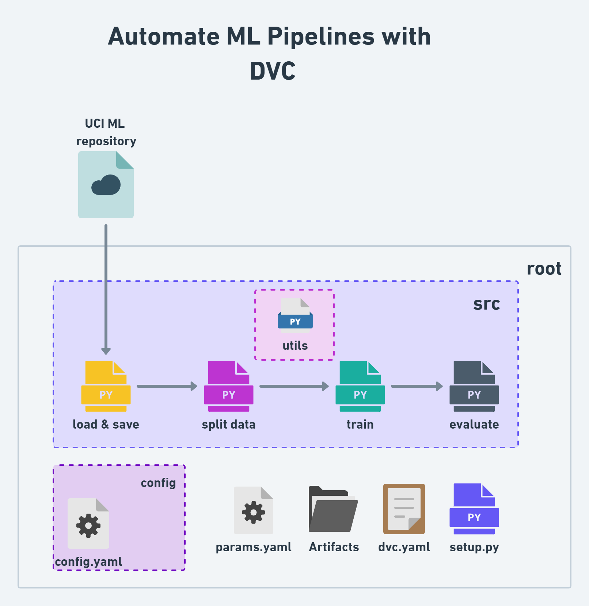

## Reference repo:
https://github.com/c17hawke/dvc-ML-demo-AIOps

## wokflow -


# STEPS:
## STEP 01: Create a empty remote repository


## STEP 02: intialize a git local repository and connect to remote repository

* open and project folder in VS code then follow below command -

```bash
echo "# dvc-ML-demo-AIOps" >> README.md
git init
git add README.md
git commit -m "first commit"
git branch -M main
git remote add origin https://github.com/USER_NAME/REPO_NAME.git
git push -u origin main
```

```bash
touch .gitignore
```
content of the gitignore can be found from reference repository


## STEP 03: create and activate conda environment

```bash
conda create -n dvc-ml python=3.7 -y
conda activate dvc-ml
```
## STEP 04: create a setup file
```bash
touch setup.py
```

paste the below content in the setup.py file and make the necessary changes as per your user ID-

```python
from setuptools import setup

with open("README.md", "r", encoding="utf-8") as f:
    long_description = f.read()

setup(
    name="src",
    version="0.0.1",
    author="USER_NAME",
    description="A small package for dvc ml pipeline demo",
    long_description=long_description,
    long_description_content_type="text/markdown",
    url="https://github.com/c17hawke/dvc-ML-demo-AIOps",
    author_email="sunny.c17hawke@gmail.com",
    packages=["src"],
    python_requires=">=3.7",
    install_requires=[
        'dvc',
        'pandas',
        'scikit-learn'
    ]
)
```


## STEP 05: create requirement file and install dependencies
```bash
touch requirements.txt
pip install -r requirements.txt
```
content of requirements.txt - Refer the reference repository

## STEP 06: initialize dvc
```bash
dvc init
```

## STEP 07: create the basic directory structure

```bash
mkdir -p src/utils config
```
## STEP 08: create the config file 
```bash
touch config/config.yml
```
content of config.yml - 

```yaml

data_source: http://archive.ics.uci.edu/ml/machine-learning-databases/wine-quality/winequality-red.csv

artifacts: 
  artifacts_dir: artifacts
  raw_local_dir: raw_local_dir
  raw_local_file: data.csv


```


## STEP 09: create the stage 01 python file and all_utils file:
```bash
touch src/stage_01_load_save.py src/utils/all_utils.py
```
content of both these files can be refererd from the reference given


## STEP 10: create the dvc.yaml file and add the stage 01:
```bash
touch dvc.yaml
```

content of dvc.yaml file -
```yaml
stages:
  load_data:
    cmd: python src/stage_01_load_save.py --config=config/config.yaml
    deps:
      - src/stage_01_load_save.py
      - src/utils/all_utils.py
      - config/config.yaml
    outs:
      - artifacts/raw_local_dir/data.csv
```

## STEP 11: run the dvc repro command
```bash
dvc repo
```

## STEP 12: push the changes to remote repository
```bash
git add .
git commit -m "stage 01 added"
git push origin main
```
